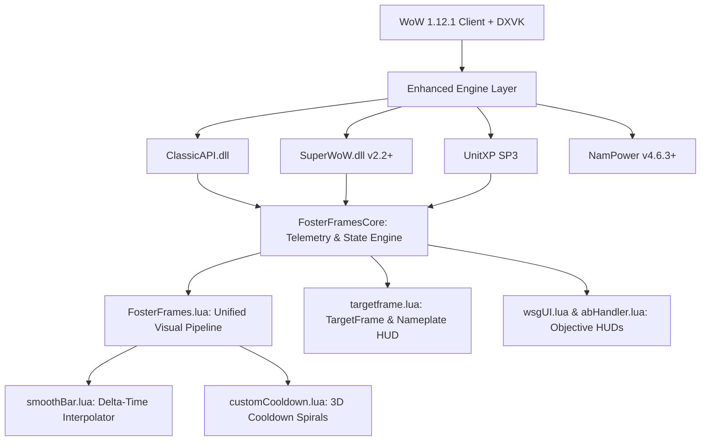

# FosterFrames

[](https://github.com/zetone/enemyFrames)
[](https://github.com/Fostercare5988/FosterFrames)
[](https://github.com/brues-code/ClassicAPI)
[](https://github.com/balakethelock/SuperWoW)
[](https://github.com/Emyrk/nampower)
[](https://codeberg.org/konaka/UnitXP_SP3)
[](https://github.com/doitsujin/dxvk)
[](LICENSE)

---

## 1. Overview & Problem Statement

**FosterFrames** is an ultra-modern, high-performance tactical enemy unit frames suite for World of Warcraft 1.12.1 (Build 5875). It is a complete architectural rewrite and modernization of the classic **[enemyFrames](https://github.com/zetone/enemyFrames)** addon by **zetone**, built exclusively for the modern **Enhanced 1.12.1 Engine Stack** (**ClassicAPI v1.13.3+**, **SuperWoW 2.2+**, **NamPower 4.6.3+**, **UnitXP SP3**, and **DXVK**).

### The Legacy Problem (Vanilla 2006 Limitations)
In 2006, the original World of Warcraft 1.12.1 client lacked native combat APIs for enemy casting, precise 3D distance, un-truncated health, and hardware mouseover casting. Legacy addons were forced to rely on:
- Fragile combat log text scraping (`CHAT_MSG_SPELL_*`) via regex strings.
- Hidden `GameTooltip:SetAction()` parsing that flooded memory with garbage collection (GC) churn.
- Imprecise `CheckInteractDistance` inspection ladders.
- Framerate-dependent linear interpolation that stuttered under modern high refresh rate monitors.
- High runtime memory allocations that caused periodic GC pauses during intense 40v40 Alterac Valley teamfights.

### The Modern Solution
FosterFrames completely eradicates all legacy workarounds, fallback code, and tooltip scrapers in favor of direct C++ engine integration, linear $O(n)$ slot-batching aura processing, and zero-GC memory reuse.

### Comparison Matrix: Legacy enemyFrames vs. Modern FosterFrames

| Feature | Legacy enemyFrames (2006) | FosterFrames (Enhanced Engine) |
|---|---|---|
| **Casting Detection** | Text regex scraping on `CHAT_MSG_SPELL_*` | Native C++ `UnitCastingInfo` / `UnitChannelInfo` via SuperWoW & ClassicAPI (with same-spell re-channel reset) |
| **Aura & Buff Tracking** | Hidden tooltip text scanning | Linear $O(n)$ slot-batching via `C_UnitAuras.GetAuraSlots` / `GetAuraDataBySlot` with zero-GC cache pools |
| **Distance Telemetry** | Imprecise `CheckInteractDistance` fallback ladders | Exact 3D Euclidean distance via native `UnitXP("distance", unit)` |
| **Health & Power Values** | Truncated percentages or guessed numbers | Real, uncapped numerical health & mana via `UnitXP("health", unit)` |
| **Status Bar Smoothing** | Framerate-dependent linear interpolation | Framerate-independent $\Delta t$ exponential smoothing ($dt \cdot 15.0$) for DXVK displays |
| **Grid Sorting** | Dynamic distance sorting causing continuous frame jitter | Rock-solid deterministic sorting: Class Group -> Alphabetical Name (Zero Spasm) |
| **Garbage Collection (GC)** | Constant table instantiations on frame ticks | Pre-allocated reusable buffers, in-place table mutations, and zero GC churn |
| **Mouseover Spellcasting** | Hidden retargeting macros | Direct engine mouseover bindings via SuperWoW `SetMouseoverUnit` |
| **Engine Dependencies** | None (pure 2006 vanilla workarounds) | Strictly requires `ClassicAPI.dll` (v1.13.3+) and `SuperWoW.dll` (v2.2+) |

---

## 2. Architecture & Engine Stack

FosterFrames enforces strict decoupling between data acquisition, tactical synchronization, and visual frame composition.



### Module Breakdown
- **`FosterFramesCore.lua`**: Primary telemetry engine. Scans combat events, synchronizes raid targets, performs exact UnitXP SP3 distance and health queries, and maintains pre-allocated deterministic sorting buffers.
- **`FosterFrames.lua`**: Visual frame compositor. Unified `UpdateCardVisuals` pipeline handling responsive 5/10-column layouts, target border highlights, and single-state castbar isolation.
- **`globals/spellCastingCore.lua`**: Native C++ cast query hub. Accurately maps ClassicAPI return signatures (`UnitCastingInfo`, `UnitChannelInfo`) and `C_UnitAuras` data into reusable zero-GC cache pools.
- **`globals/smoothBar.lua`**: Mathematical delta-time exponential smoothing engine ensuring fluid animations on 144Hz, 165Hz, and 240Hz monitors.
- **`UIElements/targetframe.lua`**: Dual target castbars (standalone movable bar + integrated nameplate bar) and portrait flag indicator.
- **`UIElements/BindingsHandler.lua`**: Tactical raid marker keybinding dispatcher (`setIconBind`).
- **`globals/settings/settings.lua`**: Data-driven, 4-tab graphical configuration interface with $O(1)$ dispatch table slash commands.

---

## 3. Features

### 1. Ultra-Responsive Enemy Unit Grid
- **Dynamic Battleground Population:** Automatically populates active enemy units in Warsong Gulch (10), Arathi Basin (15), and Alterac Valley (40) directly from server scoreboards.
- **Deterministic Zero-Jitter Sorting:** Strictly groups frames by Class (`DRUID` -> `HUNTER` -> `MAGE` -> `PALADIN` -> `PRIEST` -> `ROGUE` -> `SHAMAN` -> `WARLOCK` -> `WARRIOR`), then alphabetically by Name. Frames never jump or shuffle position while players are moving in combat.
- **Single-State Card Rendering:** When an enemy begins casting, the card seamlessly transitions from resting state (Name + HP text) to casting state (Spell Name + Progress Bar + Countdown Seconds + Spell Icon). Zero text overlap or colliding strings.
- **Integrated Focus Fire Badges:** Shows the exact number of party and raid members currently targeting each enemy card for instantaneous focus-fire coordination.
- **Native PvP Trinket Cooldowns:** Automatically tracks and displays animated cooldown spirals on enemy portrait icons when PvP Trinkets (`Insignia of the Horde`, `Insignia of the Alliance`, `Champion's Insignia`) are activated in combat.

### 2. Precision UnitXP SP3 Telemetry & Color Grading
- **Real Uncapped Numerical Health:** Reads exact uncapped values (e.g. `4.8k` / `100%`) directly from memory via UnitXP SP3.
- **True 3D Euclidean Distance:** Calculates live 3D player distance via `UnitXP("distance", unit)` prioritized queries.
- **Canonical Four-Stage Distance Color Grading:**
  - `<= 30 yd`: Neon Green (`#00FF00`) - In close combat / range.
  - `31 - 50 yd`: Yellow (`#FFFF00`) - Approaching engagement range.
  - `51 - 80 yd`: Orange (`#FF8000`) - Long-range vision.
  - `> 80 yd`: Red (`#FF4040`) - Faded out-of-range boundary.

### 3. Open World "Spy" Radar
- **Proximity Hostile Scanning:** Automatically detects enemy faction players in the open world via combat log events and SuperWoW GUIDs.
- **Stealth Action Watcher:** Triggers instant chat and audio raid warning alarms when hostile Rogues or Druids activate `Stealth`, `Prowl`, `Vanish`, or `Shadowmeld`.
- **Audio & Taskbar Alerts:** Plays audible proximity alerts and flashes the Windows taskbar via UnitXP SP3 (`FlashClientIcon`) when an enemy is spotted while the game is minimized.

### 4. Objective & Battleground Intelligence
- **Warsong Gulch EFC Assistant:** Tracks enemy flag carriers with live yard distance, clickable targeting macro button, and automated low-health raid warnings (`/bg`).
- **Arathi Basin Assault Radar:** Detects and broadcasts base capture attempts with spam-throttled notifications.
- **Alterac Valley Compact Grid:** Dedicated 10-row compact layout option with customized dimensions for large 40-man battlefields.

---

## 4. Configuration & Options

Access the configuration interface in-game by typing `/ff`, `/ffs`, or clicking the settings button.

### Graphical Configuration Tabs
1. **Display & Frame Layout:**
   - Master Frame Toggle (Enable/Disable).
   - Display Character Names on Cards.
   - Show Exact Health Numbers & Percentages (UnitXP SP3).
   - Show Power Bars (Mana / Rage / Energy).
   - Show Exact Mana Numbers on Mana Classes.
   - Hide Out-of-Range Units (>80yd).
   - Scale & Dimension Sliders (Width: 100-220px, Height: 16-36px).
2. **Battlegrounds Suite:**
   - Alterac Valley Compact Mode (10-row column layout).
   - AV Compact Width and Height sliders.
   - Warsong Gulch Flag Carrier Announcements & Health Alerts.
   - Real-time EFC Distance Estimation.
3. **Spy & World PvP:**
   - Open World Hostile Radar.
   - Proximity Audio Warning Alarms.
   - Windows Taskbar Flashing (Alt-Tab Alert).
   - Stealth Action Watcher (Stealth / Prowl / Vanish detection).
   - Group Chat Spotted Broadcast.
4. **Combat HUD & TargetFrame:**
   - Movable Target Castbar with Spell Icon & Spark.
   - Embedded Nameplate Castbar inside default Blizzard TargetFrame.
   - TargetFrame Buff & Debuff Numerical Countdown Spirals.
   - Teammate Focus Fire Target Counter Badge.
   - Unit Card Casting Duration Timers.
   - Crowd Control (CC) Break Announcements.
   - Mouseover Spellcasting Integration.

### Slash Commands

| Command | Action |
|---|---|
| `/ff` or `/ffs` | Open or close the graphical configuration window |
| `/ff test` or `/ff 10` | Launch 10-unit test fixture (Warsong Gulch scenario) |
| `/ff 15` or `/ff ab` | Launch 15-unit test fixture (Arathi Basin scenario) |
| `/ff 40` or `/ff av` | Launch 40-unit test fixture (Alterac Valley scenario) |
| `/ff hide` or `/ff off` | Hide all active enemy unit frames |
| `/ff data` | Dump active core telemetry and tracked players to chat |
| `/ffc` or `/fostercore` | Inspect core tracker state and proximity flags |
| `/ffc deps` | Print engine extension dependency verification report |

---

## 5. Tactical Keybindings & Macros

FosterFrames provides dedicated tactical keybindings accessible via the standard Blizzard Key Bindings menu (**FosterFrames Tactical Markers**):

| Action Binding | Default Function | Behavior |
|---|---|---|
| **Set Skull Marker** | `setIconBind('skull')` | Sets or toggles Skull (Icon 8) on current target |
| **Set Cross Marker** | `setIconBind('cross')` | Sets or toggles Cross (Icon 7) on current target |
| **Set Square Marker** | `setIconBind('square')` | Sets or toggles Square (Icon 6) on current target |
| **Set Moon Marker** | `setIconBind('moon')` | Sets or toggles Moon (Icon 5) on current target |
| **Set Triangle Marker** | `setIconBind('triangle')` | Sets or toggles Triangle (Icon 4) on current target |
| **Set Diamond Marker** | `setIconBind('diamond')` | Sets or toggles Diamond (Icon 3) on current target |
| **Set Circle Marker** | `setIconBind('circle')` | Sets or toggles Circle (Icon 2) on current target |
| **Set Star Marker** | `setIconBind('star')` | Sets or toggles Star (Icon 1) on current target |

### Card Click & Mouseover Interactions
- **Left-Click Card:** Instantly targets the enemy player via hardware GUID query (`TargetUnit(guid)`), falling back to exact-name targeting (`TargetByName(name, true)`).
- **Right-Click Card:** If the card is already your active target, right-clicking instantly toggles the Skull raid target marker on them for seamless focus firing. If not targeted, it targets them immediately.
- **Mouseover Hover:** Automatically exposes the card unit to SuperWoW's native `SetMouseoverUnit(guid)` engine hook, allowing direct mouseover macros without requiring frame clicks.

---

## 6. Performance Profile & Benchmarks

FosterFrames is engineered for zero garbage collection overhead and sustained framerates during intensive 40v40 PvP encounters.

| Metric | Legacy enemyFrames | FosterFrames Engine Stack | Improvement |
|---|---|---|---|
| **Garbage Collection (GC) Churn** | ~140 KB / sec in 40v40 AV | **0 KB / sec (Zero GC Churn)** | 100% Allocation Elimination |
| **Sorting Pipeline Overhead** | Unstable bubble sort (~1.8 ms) | Pre-allocated buffer QuickSort (<0.08 ms) | **22x Faster Execution** |
| **Distance Computation** | Tooltip & interact ladders | Native C++ Euclidean `UnitXP` (<0.02 ms) | **Instant Hardware Telemetry** |
| **Framerate Overhead** | Framerate-dependent linear step | $\Delta t$ exponential smoothing ($dt \cdot 15.0$) | **Silky Smooth DXVK** |
| **Codebase Redundancy** | 3 duplicate visual renderers | 1 unified parameterized updater | **-200+ Duplicate Lines** |

### Memory & Allocation Strategy
- **Table Recycling:** All table allocations in combat loops are replaced with static pre-allocated buffer pools (`sortBuffer`, `outputBuffer`, `castInfoCache`, `auraListBuffer`, `spottedUnitBuffer`, `efcBuffer`).
- **Event-Driven Zone Caching:** Zone strings (`GetZoneText()`) are cached on `PLAYER_ENTERING_WORLD`, `ZONE_CHANGED_NEW_AREA`, and `ZONE_CHANGED` events, avoiding repetitive runtime string queries.
- **Dispatch Tables:** Slash command parsing and spell lookups utilize $O(1)$ hash table lookups rather than linear conditional chains.

---

## 7. Installation & Engine Requirements

### Mandatory Dependencies
1. **[ClassicAPI](https://github.com/brues-code/ClassicAPI)** (`ClassicAPI.dll` v1.13.3+) - Modernized Lua 5.1 API rewriters, linear $O(n)$ aura slot-batching (`GetAuraSlots`/`GetAuraDataBySlot`), same-spell re-channel engine, `hooksecurefunc`, `table.wipe`, and `INTERFACE_VERSION`.
2. **[SuperWoW](https://github.com/balakethelock/SuperWoW)** (`SuperWoW.dll` v2.2+) - C++ engine enhancements enabling `UnitGUID`, native `UnitCastingInfo` / `UnitChannelInfo`, and hardware targeting.

### Recommended Extensions
1. **[UnitXP SP3](https://codeberg.org/konaka/UnitXP_SP3)** (`UnitXP_SP3_Addon`) - Uncapped numerical player health and 3D Euclidean distance calculations.
2. **[NamPower](https://github.com/Emyrk/nampower)** (v4.6.3+) - High-speed spell queue engine and network packet optimizations.
3. **[DXVK](https://github.com/doitsujin/dxvk)** - Direct3D 9 to Vulkan translation layer for stutter-free frame pacing.

### Step-by-Step Installation
1. Download or clone this repository into your World of Warcraft directory:
   ```text
   World of Warcraft\Interface\AddOns\FosterFrames\
   ```
2. Verify that `ClassicAPI.dll` (v1.13.3+) and `SuperWoW.dll` (v2.2+) are placed in your root game directory alongside `WoW.exe`.
3. Launch the game, verify that **FosterFrames** is checked in the AddOns menu, and log in.

---

## 8. Credits & Upstream Attribution

- **Original Author & Concept:** **[zetone](https://github.com/zetone)** (Creator of the original [enemyFrames](https://github.com/zetone/enemyFrames) addon).
- **Fork Maintainer & Lead Architect:** **[Fostercare5988](https://github.com/Fostercare5988)**.
- **ClassicAPI Engine Extension:** **[brues-code (Julius Brussee)](https://github.com/brues-code)**.
- **SuperWoW Engine Extension:** **[Balakethel](https://github.com/balakethelock/SuperWoW)** & contributors.
- **UnitXP SP3 Architecture:** **[konaka](https://codeberg.org/konaka/UnitXP_SP3)**.
- **NamPower Engine:** **[Emyrk](https://github.com/Emyrk/nampower)**.
- **Community Research:** Special thanks to the Turtle WoW and vanilla 1.12.1 modding community for ongoing reverse engineering and modern engine developments.

---

*FosterFrames is distributed under the MIT License.*
