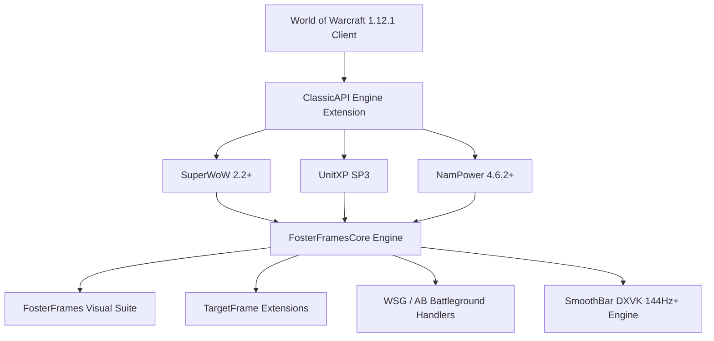

# FosterFrames

[](https://github.com/zetone/enemyFrames)
[](https://github.com/Fostercare5988/FosterFrames)
[](https://github.com/balakethel/ClassicAPI)
[](https://github.com/balakethel/SuperWoW)
[](https://github.com/dustinlacewell/nampower)
[](https://github.com/balakethel/UnitXP_SP3)
[](https://github.com/doitsujin/dxvk)
[](LICENSE)

**FosterFrames** is a modern, high-performance fork of the classic **[enemyFrames](https://github.com/zetone/enemyFrames)** addon by **zetone**, rebuilt from the ground up **exclusively** for the World of Warcraft 1.12.1 (Build 5875) Enhanced Engine Stack (**ClassicAPI**, **SuperWoW 2.2+**, **NamPower 4.6.2+**, **UnitXP SP3**, and **DXVK 144Hz+**).

---

## Why a Fork? (Legacy enemyFrames vs. Modern FosterFrames)

| Feature | Original enemyFrames (2006) | FosterFrames (Enhanced Engine) |
|---|---|---|
| **Casting Detection** | Text regex scraping on `CHAT_MSG_SPELL_*` | Native C++ `UnitCastingInfo` / `UnitChannelInfo` queries via SuperWoW |
| **Action Handling** | Hidden `GameTooltip:SetAction()` scraping | Direct SuperWoW API & hardware event bindings |
| **Distance Telemetry** | Imprecise `CheckInteractDistance` fallback ladders | Exact 3D Euclidean distance calculations via `UnitXP("distance", unit)` |
| **Health & Mana Values** | Truncated percentages or estimated values | Real uncapped exact HP via `UnitXP("health", unit)` |
| **Status Bar Smoothing** | Framerate-dependent linear interpolation hacks | True $\Delta t$ exponential smoothing ($dt \cdot 15.0$) for 144Hz+ DXVK displays |
| **Garbage Collection (GC)** | High runtime table churn on frame updates | Zero-GC pre-allocated arrays & `table.wipe(t)` recycling |
| **Engine Dependencies** | None (pure 2006 vanilla Lua 5.0 workarounds) | Strictly requires modern engine enhancements (`ClassicAPI.dll`, `SuperWoW.dll`) |

---

## Quick Start

### Installation
1. Extract or clone `FosterFrames` into your `World of Warcraft/Interface/AddOns/` directory:
   ```
   World of Warcraft/Interface/AddOns/FosterFrames/
   ```
2. Verify that **ClassicAPI** (`ClassicAPI.dll`) and **SuperWoW** (`SuperWoW.dll`) are installed in your client root directory.
3. Launch the game and enable **FosterFrames** in the AddOn selection menu.

### Slash Commands
| Command | Action |
|---|---|
| `/ff` or `/ffs` or `/fosterframes` | Open or close the FosterFrames configuration menu |
| `/ff debug` or `/ff cd` | Launch full test fixture with simulated enemy units, power bars, and cooldowns |
| `/ff data` | Dump active core player list and combat telemetry to chat |
| `/ff hide` | Hide all active enemy unit frames |

---

## Features

### 1. High-Performance Enemy Unit Frames
- **Dynamic Scoreboard Population:** Automatically populates enemy frames in Warsong Gulch, Arathi Basin, and Alterac Valley directly from server battleground metadata.
- **Delta-Time Exponential Smoothing:** Health and power status bars utilize framerate-independent mathematical exponential smoothing (`dt * 15.0`) optimized for 144Hz+ DXVK high refresh rate displays.
- **UnitXP SP3 Exact Telemetry:** Exact un-truncated health (`UnitXP("health", unit)`), maximum health (`UnitXP("maxhealth", unit)`), and true 3D Euclidean distance calculations (`UnitXP("distance", unit)`).
- **Four-Stage Distance Color Grading:**
  - $\le 30\text{ yd}$: Neon Green (`|cFF00FF00`)
  - $31 - 50\text{ yd}$: Yellow (`|cFFFFFF00`)
  - $51 - 80\text{ yd}$: Orange (`|cFFFF8000`)
  - $> 80\text{ yd}$: Red (`|cFFFF4040`)

### 2. Native Engine Castbars & Aura Tracking
- **Direct Engine Casts:** Queries `UnitCastingInfo` and `UnitChannelInfo` directly via SuperWoW, eliminating legacy combat log regex parsers.
- **Dual Target Castbars:** Supports both standalone movable target castbars and integrated nameplate castbars directly embedded into the default UI `TargetFrameNameBackground`.
- **Target Aura Timers:** Real-time remaining duration numbers and cooldown spiral models attached to target buffs and debuffs.
- **Class & Talent Spec Icons:** Automatically detects active player talent specializations via `UnitSpec` / `UnitTalent` and updates frame portrait icons.

### 3. World PvP Radar ("Spy" Engine)
- **Open World Hostile Scanning:** Automatically detects nearby enemy faction players outside battlegrounds using combat logs, nameplate queries, and GUID telemetry.
- **Audio Warning Alarms:** Plays immediate master-channel warning alarms when an enemy player enters proximity.
- **Taskbar Alerts:** Flashes Windows taskbar via UnitXP SP3 (`FlashClientIcon`) when an enemy is spotted while alt-tabbed.
- **Stealth Action Watcher:** Instant combat log alerts when Rogues/Druids activate Stealth, Vanish, Prowl, or stealth openers.
- **Party/Raid Telemetry Broadcasts:** Automatically transmits spotted enemy name, class, and level to group chat.

### 4. Battleground Intelligence & Live Test Fixture
- **Warsong Gulch EFC Assistant:** Real-time Enemy Flag Carrier tracking with live distance estimation, dynamic targeting button, and low health warning alerts (`/bg`).
- **Arathi Basin Base Defense Alerts:** Automated base assault and defense broadcast system.
- **Multi-Scenario Test Fixtures:** Live interactive preview switcher in settings (`Test: 10 (WSG)` and `Test: 15 (AB)`) with realistic simulated combat cards, live castbars, CC icons, and raid targets.
- **Addon Communication Mesh:** Zero-garbage `CHAT_MSG_ADDON` binary synchronization over `FOSTERFRAMES` prefix for instant team-wide enemy raid target coordination.
- **Raid Target Popup Menu:** Quick right-click radial menu on enemy unit frames to assign raid target icons (Skull, Cross, Square, Moon, etc.).

---

## Architecture & Engine Stack



FosterFrames is engineered with strict separation of data acquisition and visual rendering:
- **`FosterFramesCore.lua`**: Central telemetry engine. Gathers unit states, synchronizes raid targets, queries UnitXP SP3 distance and health, and calculates delta-time smoothed state updates.
- **`FosterFrames.lua`**: Visual frame compositor. Builds unit buttons, handles click-targeting (`TargetByName`), and manages responsive grid and vertical layouts.
- **`globals/smoothBar.lua`**: Framerate-independent interpolation engine for fluid bar animations under high refresh rates.
- **`globals/actionHandler.lua`**: Direct API action handling and mouseover casting support without tooltip scraping.
- **`globals/spellCastingCore.lua`**: Native `UnitCastingInfo` / `UnitChannelInfo` query hub with zero GC table recycling.

---

## Installation & Requirements

### Required Dependencies
1. **[ClassicAPI](https://github.com/balakethel/ClassicAPI)** (`ClassicAPI.dll`) - Modern Lua 5.1 API rewriter, string methods, `#` operator, and backported utility functions.
2. **[SuperWoW](https://github.com/balakethel/SuperWoW)** (`SuperWoW.dll` v2.2+) - C++ engine enhancements enabling `UnitGUID`, `UnitCastingInfo`, `UnitSpec`, `TargetByName(name, true)`, and hardware combat log events.

### Optional Dependencies
1. **[UnitXP SP3](https://github.com/balakethel/UnitXP_SP3)** (`UnitXP_SP3_Addon`) - Exact uncapped player health and 3D coordinate distance calculations.
2. **[NamPower](https://github.com/dustinlacewell/nampower)** (v4.6.2+) - High-speed spell queue engine and network packet optimizations.
3. **[DXVK](https://github.com/doitsujin/dxvk)** - Direct3D 9 to Vulkan translation layer for 144Hz+ smooth rendering.

---

## Credits & Acknowledgments

- **Original Creator & Concept:** **[zetone](https://github.com/zetone)** (Original creator of [enemyFrames](https://github.com/zetone/enemyFrames))
- **Author & Maintainer:** **[Fostercare5988](https://github.com/Fostercare5988)**
- **Engine Architecture & ClassicAPI:** **[Balakethel](https://github.com/balakethel)**
- **Enhanced 1.12.1 Tooling & NamPower:** **[Dustin Lacewell (dustinlacewell)](https://github.com/dustinlacewell)**
- **Special Thanks:** The Turtle WoW and vanilla 1.12.1 modding community for continuous support and engine modernization research.

---

## Changelog

### v1.0.0 — Modernized Fork Release
- **Rebuilt as Modern Fork:** Forked from `zetone/enemyFrames` and stripped all legacy 2006 fallback code.
- **Pure Engine Stack:** Hard requirement on `ClassicAPI.dll` and `SuperWoW.dll` with defensive startup guards.
- **Eradicated Tooltip & Log Scraping:** Direct C++ engine calls for casts, auras, and distance.
- **DXVK 144Hz+ Smoothing:** Status bars rewritten with delta-time exponential smoothing (`dt * 15.0`).
- **UnitXP SP3 Precision:** Real uncapped health and exact 4-stage color-graded 3D distance calculations.
- **Zero-GC Table Recycling:** Replaced runtime table allocations with `table.wipe(t)`.
- **Data-Driven Settings:** Modern, responsive configuration suite (`/ff`).


